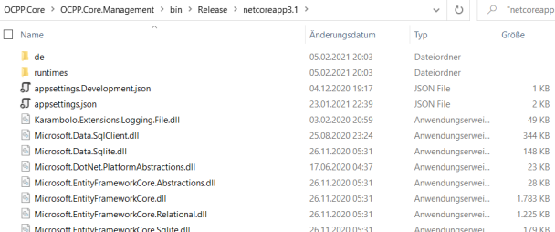
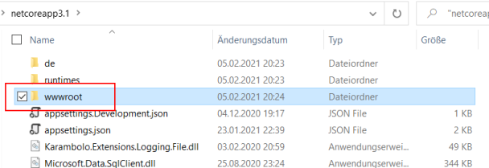

# OCPP.Core Build & Installation
**Project Structure**
OCPP.Core consists of three projects:
 - OCPP.Core.Server 
 - OCPP.Core.Management
 - OCPP.Core.Database

The "Server" is the web application the charge stations are communicating with.  It understands the OCP-Protocol  and it has a small REST-API for the Management UI.

The "Management" is the Web-UI you can open in the browser. You can manage the charge stations and RFID-tokens there. And of course you can see and download the charge-transaction lists there.

The "Database" is used by both other projects. It contains the necessary Code for reading & writing data from/into the database.


## Build with Visual Studio
If you use VS you can simply open and the compile the solution. Visual Studio will create the correct file structure in the output directory. It should look something like this:




## Build with SDK
Make sure that the [.NET-Core SDK 3.1](https://dotnet.microsoft.com/download/dotnet-core/3.1) is installed.

Open a command shell (cmd) and navigate to the folder where the "OCPP.Core.sln" file is. Then enter the following command to start a debug build:

```dotnet build OCPP.Core.sln```

You will hopefully see that all three projects were compiled without errors. You should then have the same output like the VS-Build (see screenshot above).

# Running

**Run with Kestrel (simple Web-Server)**

The compiler output for the two web projects (Server and Managment) contains an equally named executables:

```OCPP.Core.Server.exe``` and ```OCPP.Core.Management.exe```

You can simply start (double click) these executables. This will start the applications with the simple [Kestrel Web-Server](https://www.tektutorialshub.com/asp-net-core/asp-net-core-kestrel-web-server/).
You will see a command shell where the active URLs are shown and all logging output.

The appsettings.json files contain the following URL settings for the Kestrel server:

 - OCPP.Server without SSL: "http://localhost:8081"
 - OCPP.Server with SSL: "http://localhost:8091"
 - OCPP.Management without SSL: "http://localhost:8082"
 - OCPP.Management with SSL: "http://localhost:8092"
 
 Both projects contain a self-signed certificate (.pfx file) for testing purposes.


***BUT BEFORE:***

The Management Web-UI contains a few static files in a folder "wwwroot" in the project. You need to copy this folder to the compiler output directory:



Most components (bootstrap, fontawsome ...) are loaded externally from the internet. So you won't notice any errors. But with the static files missing, you cannot open chargepoints or RFID-Tokens from the table view.

**Run in IIS**

To run an ASP.NET-Core application in IIS you need to install the .NET-Core Hosting Bundle. This is described here:
https://dotnetcoretutorials.com/2019/12/23/hosting-an-asp-net-core-web-application-in-iis/

Then you can create a website or app-folder in IIS and point to the compiler output folder. Also don't forget the wwwroot-folder!
