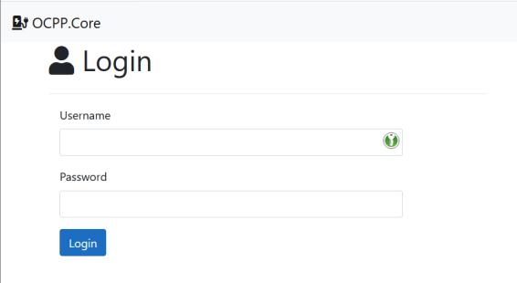
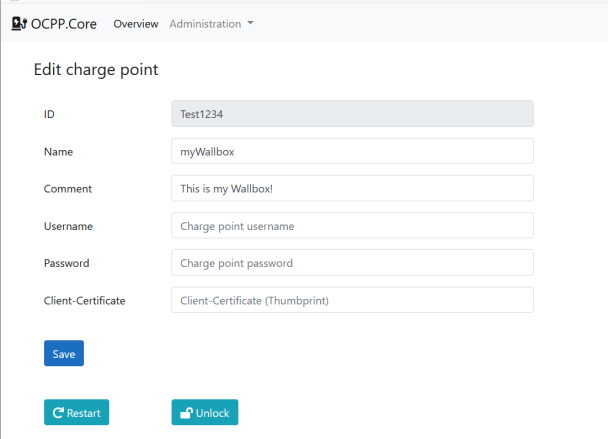
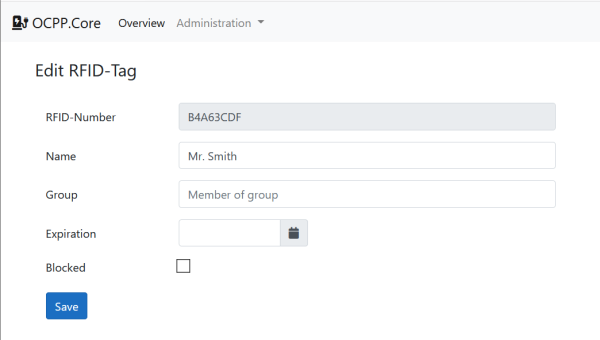

# OCPP.Core
OCPP.Core is an OCPP ([Open ChargePoint Protocol](https://en.wikipedia.org/wiki/Open_Charge_Point_Protocol)) server written in .NET-Core. It includes a management Web-UI for administration of charge points and charge tokens (RFID-Token)


### Status
Currently it supports OCPP1.6J and 2.0(JSON/REST).

OCPP.Core has only been tested with a simulator so far. My wallbox is not yet installed :-)

**Please send feedback if it works with your charge station or has issues**


The OCPP-Server currently handles the following messages:

OCPP V1.6:
* BootNotification
* Heartbeat
* Authorize
* StartTransaction
* StopTransaction
* MeterValues
* StatusNotification
* DataTransfer
* Reset
* UnlockConnector

OCPP V2.0:
* BootNotification
* Heartbeat
* Authorize
* TransactionEvent
* MeterValues
* StatusNotification
* DataTransfer
* LogStatusNotification
* FirmwareStatusNotification
* ClearedChargingLimit
* NotifyChargingLimit
* NotifyEVChargingSchedule
* Reset
* UnlockConnector

### Management Web-UI
The Web-UI is already **localized in English and German**. It has an overview page with all charge stations and its availabilty.


If you click on a charge station you get a list of the latest transactions and can download them as CSV.


The Web-UI has two different roles. A normal user can see the charge stations and transactions (screenshots above).
An administrator can also create and edit the charge stations and charge tags in the system.


### System Requirements
OCPP.Core is written in .NET-Core 3.1 and therefore runs on different plattforms.
The storage is based on the EntityFramework-Core and supports different databases.
The project contains script für SQL-Server (SQL-Express) and SQLite.

Referenced Packages:
* Microsoft.EntityFrameworkCore
* Microsoft.EntityFrameworkCore.Sqlite
* Microsoft.EntityFrameworkCore.SqlServer
* Newtonsoft.Json
* Karambolo.Extensions.Logging.File


### Configuration and Installation
1. Database preparation:   
	* SQL-Server (SQL-Express
	Use the script in the folder 'SQL-Server' to create a new database.
	Configure your account (IIS => AppPool) for reading and writing data.
		
	* SQLite
	The folder 'SQLite' contains an empty ready-to-use database file. Or you use the SQL script in the same folder.

        
2. Configuration
	The OCPP-Server and the Web-UI are independant webs/servers and both need database connection information.
	Web-UI also need user logins.

	* OCPP.Core.Server
	Edit the appsettings.json file and configure the 'SQLite' *or* 'SqlServer' entry:
	```
	"ConnectionStrings": {
	//"SQLite": "Filename=.\\..\\SQLite\\OCPP.Core.sqlite;"
	"SqlServer": "Server=.;Database=OCPP.Core;Trusted_Connection=True;"
	},
	```
	If you configure a dump directory, the server writes all OCPP requests and responses there.
	You can also log basic message information in the database.
	```
  	"MessageDumpDir": "c:\\temp\\OCPP",
	"DbMessageLog": true,
	```

	* OCPP.Core.Management

	See above for the database connection.


	The appsettings.json file also contains the user logins:

	```
	"Users": [
		{
			"Username": "admin",
			"Password": "t3st",
			"Administrator": true
		},
		{
			"Username": "user",
			"Password": "t3st",
			"Administrator": false
		}
	]
	```
	Administrators can create and edit chargepoints and tags. Users can see all chargepoints and transactions.


	The Management-UI needs the URL to the OCPP server for internal communication. The internal API is secured by a key:
	```
	"ServerApiUrl": "http://localhost:8081/API",
	"ApiKey": "....",
	```	

### Build & Run
How to build and run the application is described [here](Installation.md)


### Check Web-UI
Open the configured URL in a browser. The debug URL in the project is "http://localhost:9419/".
You should see the login screen. Enter the configured admin account.




Open the "Administration" menu and create a chargepoint with ID "station42" and a charge tag.

Administration menu:


Create new chargepoint:



Optionally, you can add authentication data for this chargepoint: Username/Passwort for basic authentication and/or a certificate thumbprint for a client certificate.
When you're editing a chargepoint you can send restart or unlock commands to the chargepoint here.

Create new charge tag:




The Web-UI is localized in English and German language

### Check OCPP-Server
An easy way to test the OCPP-Server are simulators:
* [OCPP1.6 Simple Chargebox Simulator](https://github.com/victormunoz/OCPP-1.6-Chargebox-Simulator)
* [OCPP-2.0-CP-Simulator](https://github.com/JavaIsJavaScript/OCPP-2.0-CP-Simulator)

Attention: Both simulators have bugs in certain actions


Enter "ws://localhost:8081/OCPP/station42" as the central station URL.
"station42" is the ID of the chargepoint you created in the previous step.

Enter the charge tag ID you entered before as "Tag".

Click "Connect"


	

**Attention:**
The OCPP 1.6 simulator seems to have _little bugs_ in processing responses.

```
...
if (ddata[0] === 3) {
la = getLastAction();

if (la == "startTransaction"){

	//ddata = ddata[2]; Bug1: do not modify content of ddata because is used later....
	var dd = ddata[2];
	logMsg("Data exchange successful!");
	var array = $.map(dd, function (value, index) {	// Bug1: use copy 'dd' here
		return [value];
	});
	//var TransactionId = (array[0]); Bug2 => the correct array index is 1
	var TransactionId = (array[1]);
	sessionStorage.setItem('TransactionId', TransactionId);
}
...
```
